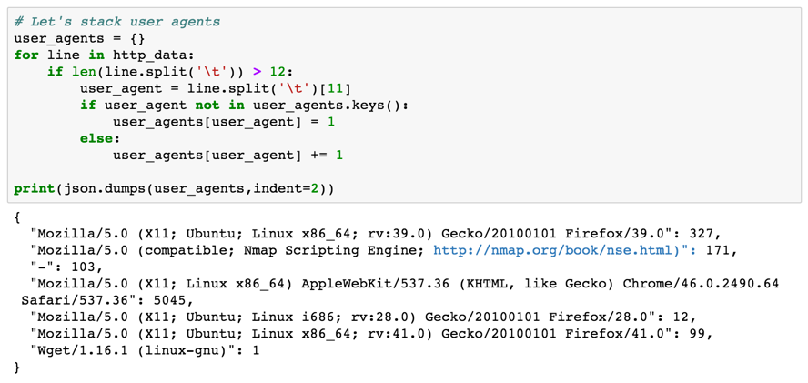
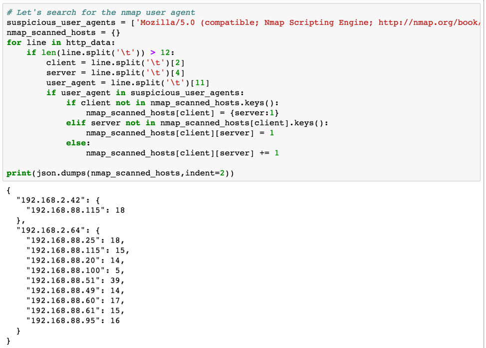
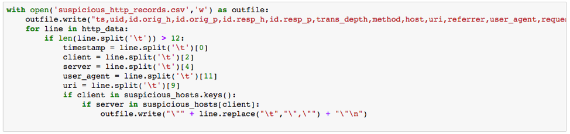

# Threat Hunting with Python: Prologue and Basic HTTP Hunting

*Originally published at [dgunter.com](https://dgunter.com/2017/09/17/threat-hunting-with-python-prologue-and-basic-http-hunting/) on 2017-09-17; recovered from the [Wayback Machine](http://web.archive.org/web/20180221151955/https://dgunter.com/2017/09/17/threat-hunting-with-python-prologue-and-basic-http-hunting/) on 2026-09-05.*

## **Prologue: Begin the Hunt**

You’ve developed a solid network and host-based detection strategy. You are comfortable with the technology you purchased, and processes you developed should you do start getting alerts and might need to open an investigation. You might wonder what the next step should be. The truth is no product or process is perfect nor truly comprehensive at detecting an intrusion into your network. There is no silver bullet in security. Just as defenders adapt and overcome defenses to meet weaknesses, attackers also adapt and overcome to bypass new layers of defense. The creation of a reliable threat hunting strategy and implementation of that strategy can help overcome gaps present in your detection plan. Threat hunting is a human-driven defensive process that seeks to uncover entrenched threats beyond the capabilities of existing protective layers.

The hunting process consists of developing a hypothesis for where an attacker might be found, collecting the necessary artifacts to prove or disprove the generated hypothesis, analyzing the collected evidence, and finally automating the steps taken to save time in the future. The purpose of this series is to help with the automation piece. Over the next few weeks, we will look at basic analytic approaches that can be taken to examine some of the most common protocols found on typical networks. This week we will get started with basic HTTP analysis using Python and Jupyter notebooks. Python is a powerful and easy to use scripting language with a relatively light learning curve relative to other options. If you are just here for strategy and not the coding portion, no need to set up your python environment. If you are following along, we created a GitHub repo with the code [here](https://github.com/dgunter/Blog-Code/tree/master/Bro%20HTTP%20Log%20Analysis).

Jupyter Notebooks can be installed using the instructions on [Jupyter’s webpage](https://jupyter.org/install.html). You can install Jupyter via pip if you want, but I recommend following the advice about using Anaconda. The community edition of the [Anaconda Platform](https://www.anaconda.com/download/) includes both Python and Jupyter Notebooks as well as several other data science tools and works across Windows, OS X and Linux. Best of all, Anaconda’s community edition is completely free. We used Python 2.7, however, the code we will be writing works on either. Download and install Anaconda before you proceed to the next portion if you plan to follow along with the source code. Once you have Anaconda installed, you should be able to find Jupyter notebooks on the Windows start menu or be able to launch the anaconda-Navigator on OS X and then launch Jupyter notebooks.

## **Part 1: Analyzing HTTP**

Hypertext Transfer Protocol (HTTP) is a staple protocol both for traditional endpoint systems and many embedded devices. Everything from vehicle entertainment systems to [Ronald Teune’s modified Philips Senseo coffee machine](http://www.ronaldteune.nl/projects/index.php/Coffee_machine) to the servers and clients that make up the corporate networks that enable businesses to be productive use HTTP to produce and consume data. As networks grow larger, so does the volume of HTTP traffic threat hunters must comb through. Automating analysis will be the only way to keep up with the amount of traffic.

Today, we will be using logs from the [Bro Intrusion Detection System](https://www.bro.org/). Bro originated from a team working at the International Computer Science Institute in Berkeley, CA, and the National Center for Supercomputing Applications in Urbana-Champaign, IL. Bro provides a free and open source platform that can be scaled to handle large volumes of traffic and, most importantly to us, logs that suit threat hunting efforts well. You can mirror live traffic off your network into a Bro instance or feed a packet capture file through Bro to generate the needed logs for hunting. The HTTP log we will examine came from a single day of the 2015 4SICS security conference’s lab network which is an industrial control system security conference now named CS3STHLM. While it would be possible to analyze this file manually, scripting saves a lot of time and prevents human error.

The first threat hunting approach we will use is called stacking. Stacking is a simple but useful way to look at outliers in a set of data by counting encountered values within a log. The first value we will stack on is the user agent. User agents can easily be modified, but that doesn’t mean an attacker will remember or not make a mistake with a scanning tool. Let’s develop a quick hypothesis about user agents and start hunting.

**Hypothesis 1:** *Attackers will use scanning and service enumeration tools during reconnaissance with identifiable characteristics that show up in the user agent and URI field of HTTP logs.*

Now that we have a testable hypothesis and we have collected the log files needed to prove or disprove the developed hypothesis, we move into the analysis phase. Here are the results of stacking user agents:

Only seven unique user agents were seen in the HTTP logs. One of the user agents that immediately stands out hopefully is the second one that contains Nmap Scripting Engine. The number after the colon indicates this user agent was seen 171 times. Let’s now use another hunting technique known as searching to retrieve all records that contain the Nmap user agent.  We are going to search for the user agent and format our data results as a JSON document containing the client who made the request as the outer key, the servers who handled requests from a given client as the inner key and finally the number of requests as the inner value to the inner key. If this doesn’t make sense, check the output and commentary below.

We now see the two clients that used Nmap, the hosts they made requests to on the network, and the number of requests made. This list only contains requests that use the particular user agent. Now we will go back and look at all requests between the clients and servers above and look at other HTTP activity around the time the scans took place.

The resulting CSV file contains all the information from the Bro HTTP logs. After a quick scan of the CSV file, you should be able to see that HTTP interaction from 192.168.2.64 is only limited to Nmap scans. 192.168.2.42 scans a single machine and then begins to interact with the website on port 80. We’ve now proven our hypothesis that HTTP reconnaissance was used within the traffic capture in question.

## **Takeaways**

The findings so far should feed into the rest of the investigation cycle to complete the rest of your organization’s event response plan. The event response plan should contain steps to validate that the scan was or wasn’t authorized on the subnet in question. HTTP logs are one potentially useful resource, but the investigation shouldn’t stop after examining just one log type.

- We started with a suspicious user agent and ended up finding to machines performing Nmap scans on the network.
- We discovered useful HTTP based Nmap scan indicators for later hunts
- Automation should account for attacker modification of a subset of fields as attackers might modify indicators before scanning

### Potential Nmap Indicators in HTTP Logs

### img3.png

### **What’s Next**

We produced indicators this week to detect nmap scans based on HTTP traffic. While indicators are useful for detection of known threats, behavioral detection can move beyond just identifying known threats and can potentially detect unknown scanners or scanners that you don’t already have indicators for. Check back in two weeks, and we will explore a behavioral approach.

All code related to the examples above are in [this Github repo](https://github.com/dgunter/Blog-Code/tree/master/Bro%20HTTP%20Log%20Analysis).

If you have any questions or topic suggestions, feel free to reach out to me on [twitter](https://twitter.com/dan_gunter) or [LinkedIn](https://www.linkedin.com/in/dan-gunter).

Title image from [Nina Matthews Photography](https://www.flickr.com/photos/21560098@N06/) used under the Creative Commons License.
