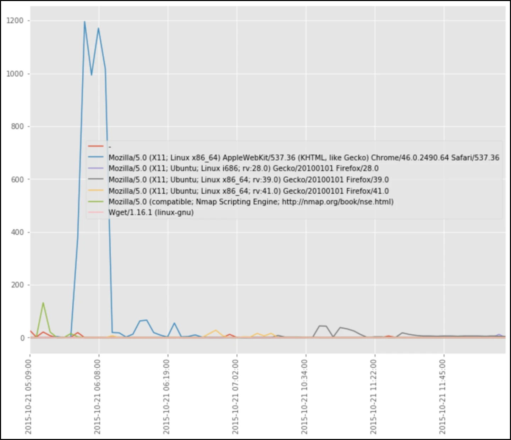
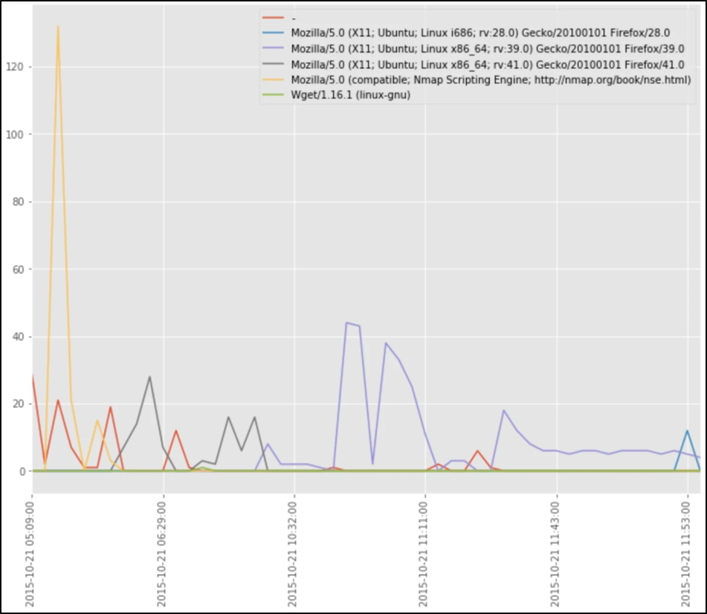
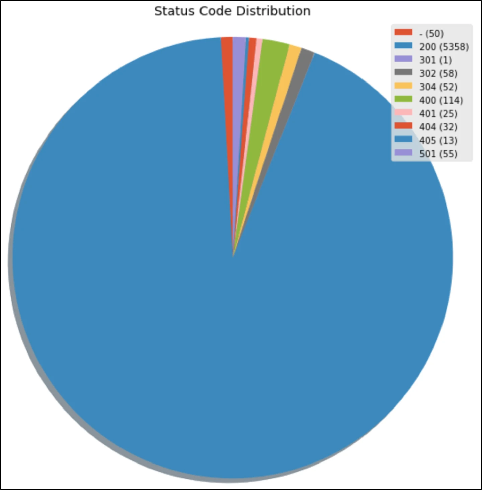
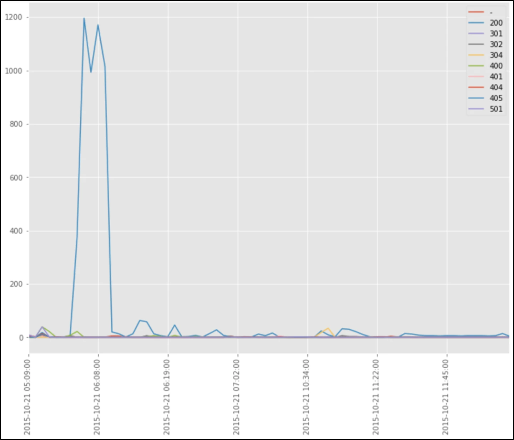
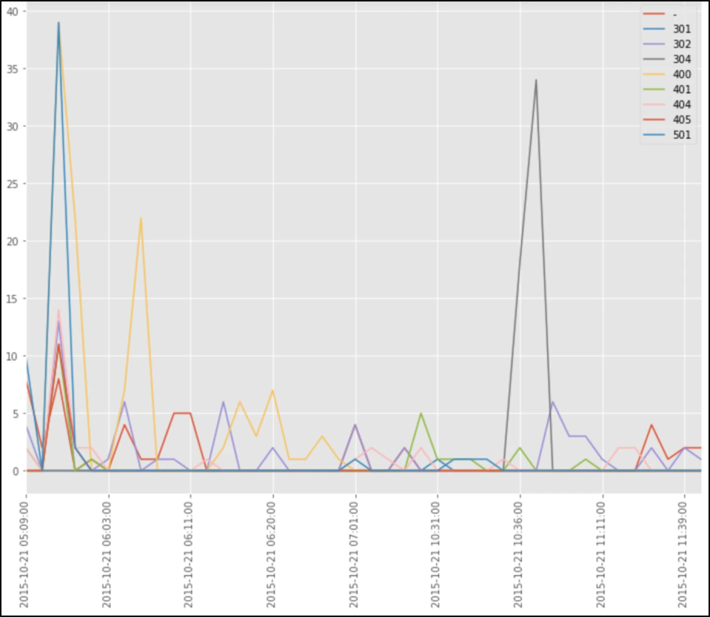

# Threat Hunting with Python Part 2: Detecting Nmap Behavior with Bro HTTP Logs

*Originally published at [dgunter.com](https://dgunter.com/2017/11/28/threat-hunting-with-python-part-2-detecting-nmap-behavior-with-bro-http-logs/) on 2017-11-28; recovered from the [Wayback Machine](http://web.archive.org/web/20190711004650/https://dgunter.com/2017/11/28/threat-hunting-with-python-part-2-detecting-nmap-behavior-with-bro-http-logs/) on 2026-09-05.*

This is the second part of a series I originally **[posted on the Dragos Blog](https://dragos.com/blog/20171121ThreatHuntingWithPythonPt2.html).**

## Prologue: Begin the Hunt

In the last edition of this series, we detected Nmap scans by looking for URI indicators associated with Nmap. This week we are going to move away from URI based indicators and focus on Nmap’s behavior on the network. The notebook used for analysis can be found [here on GitHub](https://github.com/dgunter/Blog-Code/blob/master/Bro%20HTTP%20Log%20Analysis/Detecting%20Nmap%20Behavior%20with%20Bro%20HTTP%20Logs.ipynb).

Last time we analyzed URIs found in HTTP logs to find Nmap scans. This technique worked because certain Nmap modules use hardcoded URIs. We saw the request for flumemaster.jsp due to the [flume-master-info nmap script](https://github.com/nmap/nmap/blob/master/scripts/flume-master-info.nse) that attempts to retrieve information from Apache Flume servers. Dfshealth.jsp comes from Nmap’s [Hadoop-NameNode-info nmap script](https://github.com/nmap/nmap/blob/master/scripts/hadoop-namenode-info.nse) to retrieve data from Apache Hadoop’s NameNode host. The request for “/nice ports,/Trinity.txt.bak” comes from Nmap’s service detection routine testing how a server [handles escape characters within a URI](http://seclists.org/nmap-dev/2006/q2/162). The actual request is “GET /nice%20ports%2C/Tri%6Eity.txt%2ebak HTTP/1.0\r\n\r\n”.

But what happens when an attacker doesn’t run all the modules that generate the requests to the above URIs? The individual(s) responsible for the scans that generated this log output likely ran Nmap with the ‘–a’ option that caused all Nmap scripts on the machine to run. A more sophisticated attacker will probably be more conservative with the footprint left on the victim network. This week we will move away from hard-coded indicators and begin to look at behavioral indicators. Behavioral indicators allow identification of scanning in an environment beyond just that of Nmap.

## Dataset Recap

The dataset used for analysis again comes from the 2015 4SICS conference geek lounge which featured both traditional endpoint systems and Industrial Control System devices. A full packet capture and the corresponding Bro IDS logs are available on automayt’s [GitHub repo](https://github.com/automayt/ICS-pcap/tree/master/Additional%20Captures/4SICS-GeekLounge-151021). The http.log file found in the repo comes from Bro IDS’ analysis of the packet capture.

##### User Agent Analysis

Let’s begin by looking at user agents within the environment. For organizations with mature software inventory management policies, user agents tend to be static. Almost all traffic tends to originate from the top two or three user agents on the network as these are the approved applications. The same is true within the production and OT portion of industrial networks where the environment is relatively static from a change perspective. Let’s first map the user agents seen in the environment over time. Since the pcap we have only covered five hours, we are going to break down our analysis into minute longs groups. The below image is only a subset of the entire user agent table.

Within the sample data, “Mozilla/5.0 (X11; Linux x86\_64) AppleWebKit/537.36 (KHTML, like Gecko) Chrome/46.0.2490.64 Safari/537.36” is the clear winner for the most used user agent. This sample data isn’t representative of a typical corporate or industrial network as it came from a security conference but does demonstrate the typical distribution of a static network. With a single line of code, we can generate a plot from this table.

This graph isn’t handy because of the frequency of the top user agent. Let’s massage the data a bit to see if we can get a more useful view. We are going to remove the most frequent user agent and re-generate the table and plot. The most frequent user agent doesn’t look immediately suspicious, but should still be checked against threat intelligence and other sources to test for association with other intrusions.

Hopefully, the user agent named “Mozilla/5.0 (compatible; Nmap Scripting Engine; <http://nmap.org/book/nse.html>)” immediately stands out to you. This user agent is another good quick indicator of Nmap scans but isn’t behavioral. The other interesting user agent is “-” which means no user agent was present (Bro IDS uses “-” in logs to indicate no value present).

Using this graph, we also quickly see Nmap ran from 0500-0700 on 2015-10-21. The no user agent activity, however, runs from 0500-0800. User agents aren’t an excellent source alone to find malicious behavior as developers who code applications that make HTTP requests can forget to add user agents to the request code. In the same manner, malware developers can set user agents to just about anything. In practice, we’ve noticed an increase in no user agents observed on the network during Nmap scans. Context is vital in helping security analysts understand if and when a given user agent should occur.

## Status Code Analysis

User agents provide one possible indicator to hunt off, but are client side and can easily be manipulated by attackers. Another characteristic of HTTP sessions optimal hunting are status codes. Status code definitions come from the HTTP specification document and break into five categories. 1xx series codes are informational, 2xx series codes indicate success, 3xx codes indicate the client must redirect to obtain the requested information, 4xx series codes indicate client errors and 5xx series codes represent server errors. The most common status codes you will likely encounter are 200 indicating an HTTP request was successful, 301 indicating the requested resource has moved and 404 indicating the server could not find what the client requested.

In our earlier discussion, we looked at several URIs present in Nmap modules. Flumemaster.jsp and “/nice ports,/Trinity.txt.bak” are two examples from earlier. When Nmap requests this URI, the server will likely respond with a 404 status code unless these files exist on the server. Other Nmap modules result in other HTTP status codes being returned based on the request made. Our analysis will focus on the “normal” distribution of HTTP status codes on a given network. Status code analysis allows us to look for outliers that might represent malicious traffic. Industrial networks are a prime candidate for HTTP status code analysis as the number of unique status codes seen is typically very limited.

Let’s get startyed by looking at the distribution of HTTP status codes.

As expected, the 200 status code for success dominated the results. We also see quite a few 3xx redirect status codes, a mix of 4xx client error status codes and a single server error status code. The status code with “-” means no status code was set. Not having a status code should also raise suspicion. Let’s now look deeper and map the status code distribution over time.

The above graph shows the status code quantity over time. As we can see, a majority of the successful HTTP requests occurred very early in the packet capture. This plot is, unfortunately, the only real fact we can derive is that the quantity of 200 status codes dominates the dataset. Let’s remove the 200 status code and redraw the graph.

This plot is much more useful. We see a significant spike in at least five types of HTTP status codes in roughly the same spot of the packet capture as our earlier 200 status code spike. We’ve found this status code quantity spike to be very indicative of Nmap scans. Additionally, the presence of the “-” code that indicates no status code present also typically occurs when an attacker uses the “-A” flag with Nmap.

## HTTP in Industrial Environments

Asset owners should focus on the use of HTTP within OT environments. HTTP traffic typically transits between human-machine interfaces (HMI) and users. Certain models of programmable logic controllers (PLC) also contain embedded web servers that use HTTP. Within the OT environment, HTTP usage is somewhat predictable from a behavioral standpoint. Asset owners can significantly benefit from an understanding of the behaviors of devices within their OT environments.

The first step asset owners should take involves the creation of an inventory the characteristics of HTTP clients and hosts within the environment. After collection of the inventory, the indicators associated with each client and server should be identified. Behaviors for each client and server concerning status codes and access behavior are two areas that might be considered. Frequent threat hunts that map the behavior of HTTP then can be used to detect intrusions. The techniques outlined in this post provide a few ideas for a successful hunt.

## Moving Forward

Nmap is not the only network scanner where certain scans can be detected in HTTP traffic. Other scanners could use atypical user agents in your environment not typically present. HTTP status codes provide a more promising option for detecting scanning as any tool that uses a hard-coded URI not present on the scanned server will generate a 404 or other HTTP error message.

Detection of scanning on your network also shouldn’t be done solely with HTTP logs. HTTP logs do however provide a viewpoint many don’t consider when attempting to detect adversary reconnaissance. You won’t detect an attacker that doesn’t use Nmap’s ‘-A’ option or run scripts that generate HTTP traffic as their behavior won’t be exposed in HTTP logs. To detect the attacker mindful of their footprints on the network, you will likely have to use several log types. This doesn’t mean however that HTTP logs should be discounted during threat hunting and detection activities.

In the next edition of this series, we will transition over to Bro communication logs and look at different approaches and scenarios where communication logs are useful during a threat hunt. Have any comments, questions or ideas? Reach out to me on [Twitter](https://twitter.com/dan_gunter), [LinkedIn](https://www.linkedin.com/in/dan-gunter/) or via email at [dgunter@dragos.com](mailto:dgunter@dragos.com).
