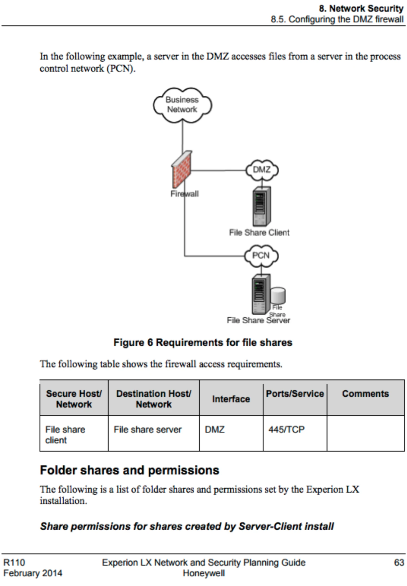
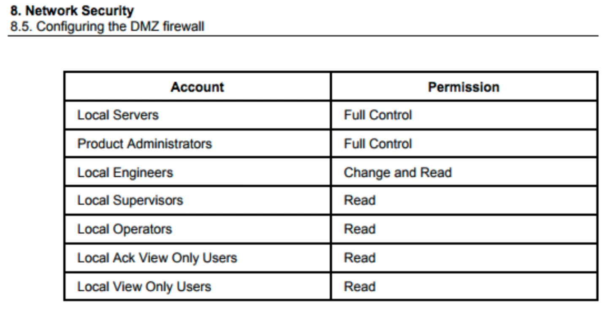
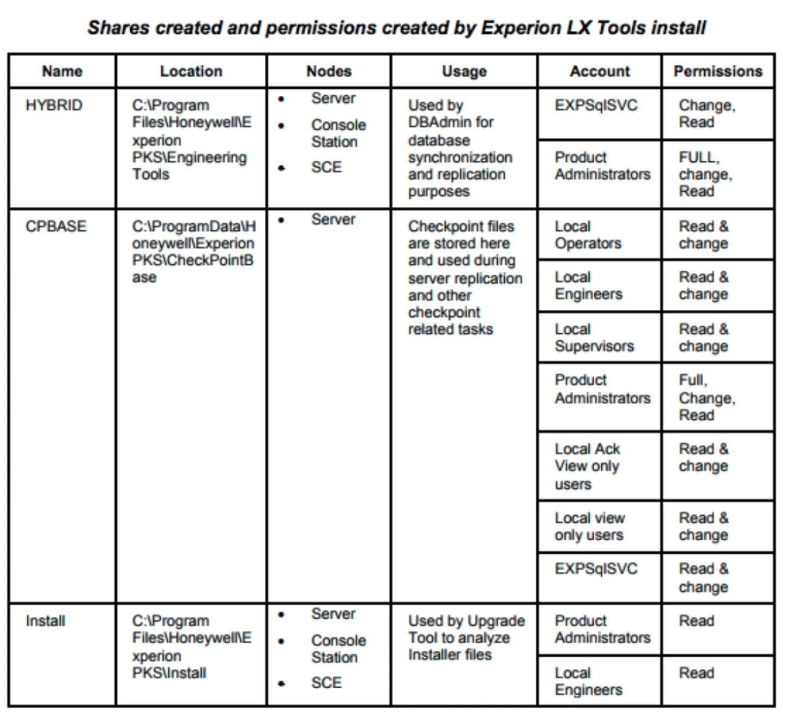
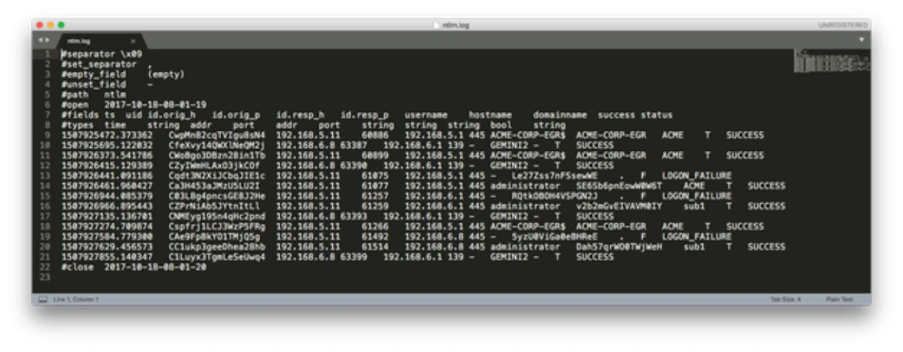
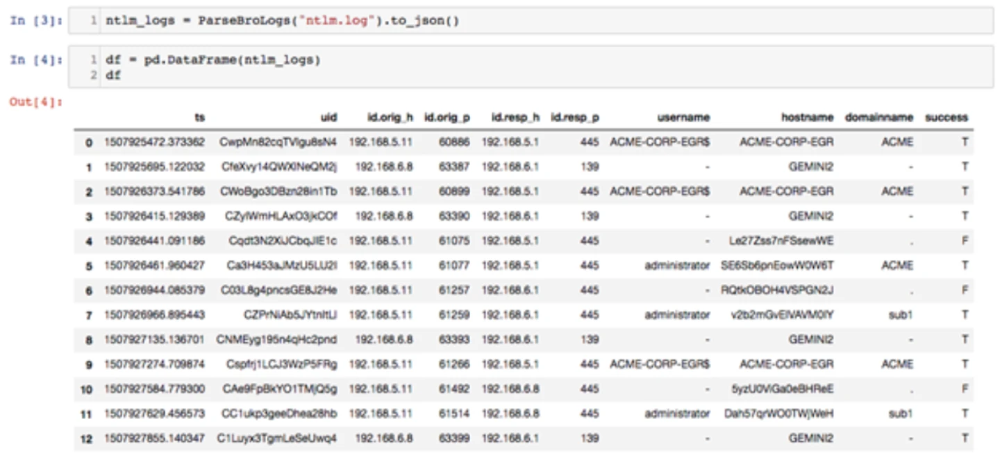
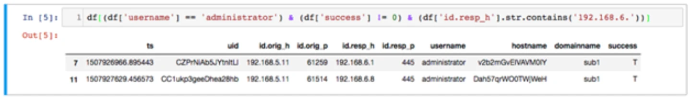

# Threat Hunting with Python and Bro IDS Part 3: Taming SMB

*Originally published at [dgunter.com](https://dgunter.com/2018/02/17/threat-hunting-with-python-and-bro-ids-part-3-taming-smb/) on 2018-02-17; recovered from the [Wayback Machine](http://web.archive.org/web/20190711050412/https://dgunter.com/2018/02/17/threat-hunting-with-python-and-bro-ids-part-3-taming-smb/) on 2026-09-05.*

This is the third part of a series I originally **[posted on the Dragos Blog](https://dragos.com/blog/20180130ThreatHuntingWithPythonPt3.html).**

2017 was a busy year for attackers. Between the WannaCry/Petya/Bad Rabbit ransomware, GOP hacks, Game of Thrones/HBO hacks, Equifax breach and the TRISIS malware that targeted industrial control safety systems in the Middle East, many new proven attack scenarios developed that defenders should account for within their security strategies. This week we will focus on the Server Message Block (SMB) protocol that enabled Wannacry, Petya, and Bad Rabbit attacks to be lethal at the global level and what defenders can do to hunt within this protocol.

## Setting the Stage

On April 14th, 2017 the ShadowBrokers leaked an Equation Group tool called ETERNALBLUE that enabled attackers to exploit Windows machines running SMBv1. Less than a month later ETERNALBLUE allowed the WannaCry ransomware to quickly spread both to systems with SMB exposed to the internet and through a suspected spear phishing campaign. Two months later, ETERNALBLUE acted as a propagation vector during the Petya ransomware campaign. While Microsoft did [release a security bulletin that patched the vulnerabilities a month before the ShadowBroker leak](https://docs.microsoft.com/en-us/security-updates/securitybulletins/2017/ms17-010), the WannaCry and Petya attacks still demonstrated the effectiveness of SMB targeted worms.

## What SMB is and Why it Matters to Industrial Networks

SMB (also commonly known as Common Internet File System or CIFS) is a file and resource sharing protocol that uses TCP and UDP over IP. Development credit for the Server Message Block (SMB) protocol points to an IBM engineer named Dr Barry Feigenbaum who developed the initial protocol specification in the early 1980s. Over the years, Microsoft added additional features and optimizations and eventually released a proprietary version of SMBv2 in 2006 and SMBv3 in 2012. As of today, SMBv2 and SMBv3 provide significant network optimizations to network systems. Microsoft offers a full list of the benefits of SMB [on this page](https://support.microsoft.com/en-us/help/2696547/how-to-detect-enable-and-disable-smbv1-smbv2-and-smbv3-in-windows-and).

Specific to industrial control networks, SMB provides remote directory services that many Windows-based control systems rely on to properly operate. One example includes Honeywell’s Experion Process Knowledge System (EPKS). [Honeywell’s network and security planning guide](https://www.honeywellprocess.com/library/support/Public/Documents/Network_and_Security_Planning_Guide_EXDOC-XX75-en-110.pdf) does an outstanding job of outlining SMB usage within the control network and the file shares involved. Honeywell is just one vendor who uses SMB, but we chose them for this discussion due to the high level of information security relevant information provided.

As seen in the image above, for a file share server in the process control network (PCN) to provide information to a file share client in the PCN DMZ, the firewall must have the rule to allow SMB traffic between the PCN DMZ and PCN. The business use for this rule might include monitoring alarm data from Experion servers within the PCN. This firewall rule enables machines in the business network to potentially access the file share client in the DMZ but also increases risk as the PCN’s SMB service is now exposed to potential exploitation. In this case, it is recommended to block SMB between the business network and PCN to prevent Wannacry/Petya situations where propagating malware is using SMB.

The Experion PKS system also defines a specific configuration of access groups and permission levels. Also, Honeywell provides the shares created, location, nodes and general usage of the shares. This type of information is useful for defenders as the data provides valuable context to behavior-based hunting within the environment.

Specific to account levels, hunters on Honeywell Experion networks now know that accounts in Local Servers and Product Engineers should closely be analyzed as they have full control over the shares. The local supervisors, local operators, local ack view only user and local view only users groups should just have read permissions and pose less risk in an account compromise situation.

We only looked at one of the SMB shares created tables. However, Honeywell provides context on what network shares exist and the location, which system roles should access the network share and what that network share supports. This data provides the background needed to perform system based behavioral threat hunting due to knowing expected behavior.

The information Honeywell provides is all good news for Honeywell based networks, but what if you aren’t using Honeywell? You should use the techniques outlined later in this blog entry to generate information about how SMB works within your environment. Your particular vendor might also provide a guide similar to Honeywell’s network and security planning guide.

Regardless of if the vendor doesn’t have a similar guide, threat hunting hypothesis should be developed and tested to gain a better understanding of your particular installation.

## Let’s go Hunting!

We’ve talked about SMB and SMB’s role in industrial networks. Lets now move onto the practical part and start digging through data. To generate data, we set up two domain controllers. One domain controller simulated the corporate domain while the other simulated a PCN subdomain. The corporate domain sits in the 192.168.5.0/24 IP range while the PCN subdomain sits in the 192.168.6.0/24 subnet.

We used Metasploit’s PSExec exploit tool which is based off Mark Russinovich’s Sysinternals PSExec tool to access machines via SMB remotely. Rapid7 outlines the different PSExec options available in Metasploit in [a blog post here](https://blog.rapid7.com/2013/03/09/psexec-demystified/).

## Auditing User Access

We used Bro IDS’ SMB module to generate the NT Lan Manager (NTLM) Security Support Provider log file seen above. The traffic we captured only covered 49 total minutes of traffic on a relatively quiet network. As seen above, we can quickly see the source host, destination host, username, hostname, domain name and status for each authentication request. On a production network with a high reliance on SMB, this log will likely be much longer. Python is an ideal tool to analyze more massive log files.

With a large dataset, a truncated version of the pandas data frame would be output. In our example, we now see the 12 records from the ntlm.log file. With the Bro log file loaded in pandas, we can now use Python to search for specific fields and values we are interested. Within the context of our simulated data, we want to look for potential pivots between the corporate subnet (192.168.5.0/24) and PCN subnet (192.168.6.0/24) or malicious use of privileged or special accounts. Let’s look at the use of the network administrator account going within the PCN subnet.

As shown above, we have two instances where the administrator account logged into a host within the PCN network. Python is powerful but additional context to the situation on the network traffic adds another very important layer to this analysis. In our mock organization, an administrator account should never authenticate between the corporate and PCN network. Additionally, the context of the source host was an individual engineer’s workstation on the corporate network connecting to the engineer’s workstation within the PCN network and the domain controller of the PCN network. While an extreme scenario, we were able to diagnose and pare down a log file to locate information needed for our investigation.

## Moving Forward

We showed one example of how an organization might investigate SMB using Bro logs and Python. SMB has many more features to explore and opportunities to develop additional analytics. Other areas to study specific to industrial networks should include who is accessing network shares and how, when and how network devices and users leverage SMB services and trust relationships between subnets. The reliance of industrial control system devices on SMB means SMB won’t be going away anytime soon, so organizations should ensure they develop both strategy and processes to manage and secure SMB on both industrial and IT networks.
