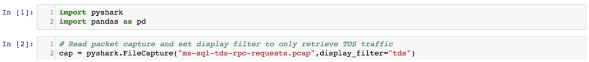
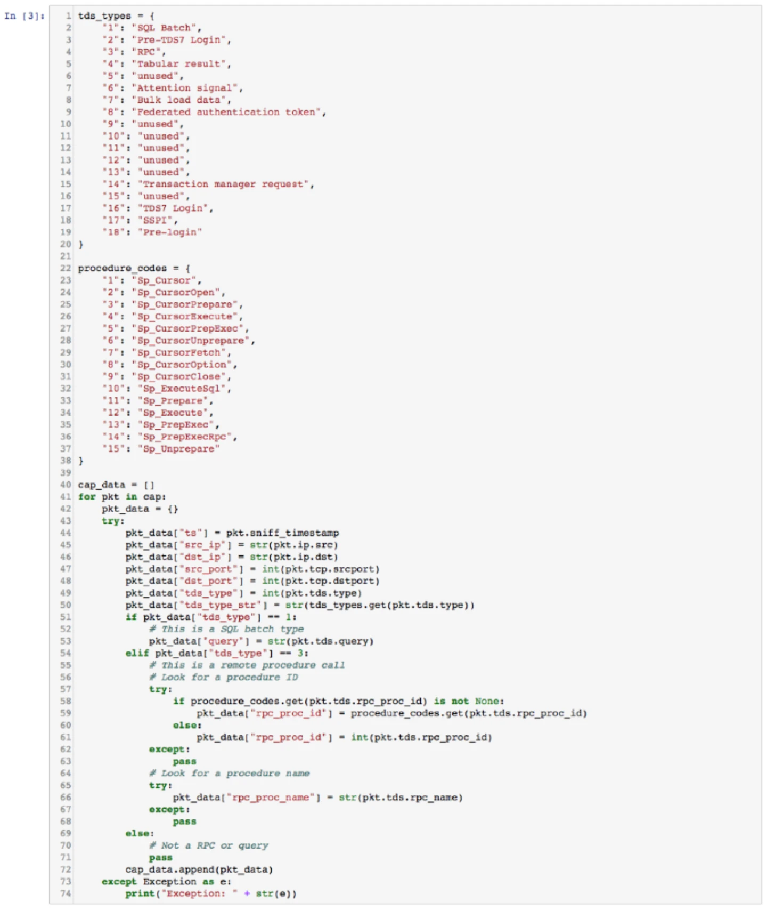
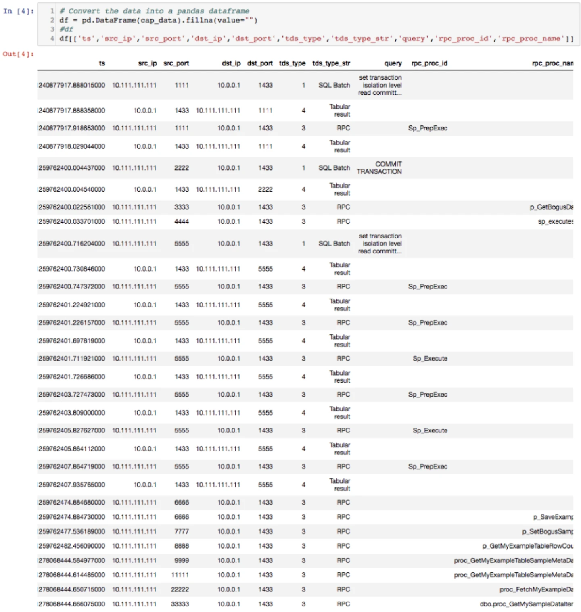
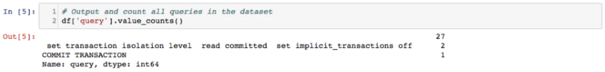
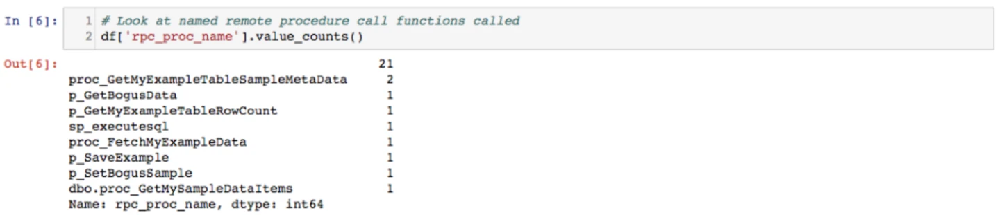
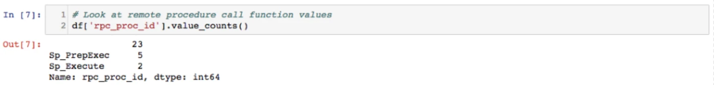
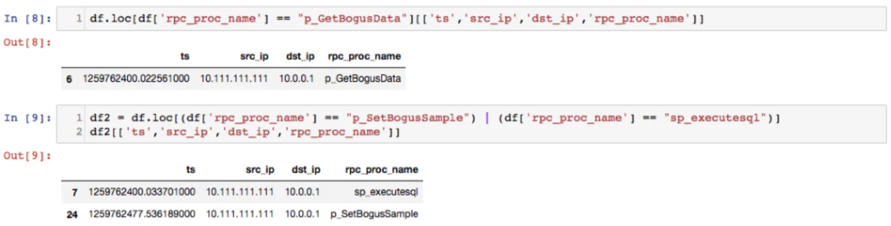

# Threat Hunting With Python Part 4: Examining Microsoft SQL Based Historian Traffic

*Originally published at [dgunter.com](https://dgunter.com/2018/03/20/threat-hunting-with-python-part-4-examining-microsoft-sql-based-historian-traffic/) on 2018-03-20; recovered from the [Wayback Machine](http://web.archive.org/web/20190711052703/https://dgunter.com/2018/03/20/threat-hunting-with-python-part-4-examining-microsoft-sql-based-historian-traffic/) on 2026-09-05.*

This is the fourth part of a series I originally **[posted on the Dragos Blog](https://dragos.com/blog/20180306ThreatHuntingWithPythonPt4.html).**

Working in the ICS information security space affords the opportunity to visit some cool critical infrastructure sites. From massive refineries that turn raw crude into diesel and gas to wind farms that harness the power of nature to generate electricity, it is easy to get caught in awe of the process itself and ignore some of the lower-level characteristics of control systems. This week, we will look at a protocol commonly overlooked by many but crucial to control system operation. The Tabular Data Stream (TDS) protocol is a core component of many data historians and plays a significant role in industrial networks. We will define TDS, where TDS typically lives, and how to hunt in TDS data.

## What is Tabular Data Stream

The Tabular Data Stream (TDS) protocol is an application layer protocol initially invented by a former enterprise software and services company, Sybase, in the mid-1980s. In 1986, Microsoft entered an agreement with Sybase to license Sybase’s DataServer application. The agreement between Sybase and Microsoft led to the first version of Microsoft SQL Server. In 1993, Microsoft ported SQL Server to Windows NT, adding the ability to use native management and networking features built into Windows. Microsoft hails the movement of SQL Server to Windows NT from the legacy IBM OS/2 environment as a considerable success. In 1994, Microsoft and Sybase parted ways.

TDS continues to play a critical role in Microsoft SQL server today. Structured Query Language (SQL) queries and responses travel via TDS to and from Microsoft SQL servers. Additionally, Microsoft proves the ability to call user-defined functions, also referred to as remote procedure calls, using TDS. As with SMB, Microsoft has a [great reference page for TDS and how the protocol works here](https://msdn.microsoft.com/en-us/library/dd304523.aspx). Simply put, TDS is the database language of systems that rely on Microsoft SQL Server.

## Where is TDS Used on Industrial Networks

When we see TDS on industrial networks, generally the traffic is related to the operational historian. GE’s Proficy/iFix historian, Honeywell’s Uniformance Process History Database, and Schneider Electric’s Wonderware historian all rely on Microsoft SQL Server to some degree on the back end. It is worth pointing out that not everyone in the industry relies on Microsoft SQL server or other popular database back ends. OSIsoft has its proprietary database format, PI Archive, that does have an interface for communicating within the SQL standard.

We often see TDS traffic on industrial networks between hosts that interact with the historian. Homegrown scripts that scrape metrics from historians we have seen in production environments also commonly use SQL APIs to query data. We have also widely seen TDS traffic between hosts that are expected to, and regularly interact, with the historian. Some historian manufacturers have written their own communications protocols for messages, but others still rely on TDS for SQL Server features.

## Hunting in TDS

To dive into TDS traffic, we used a Python module named pyshark. Pyshark is a wrapper for tshark and allows Python access to live network traffic or packet capture files. We imported pyshark and used the FileCapture method to read the packet capture file. We provided a display filter into the FileCapture method to filter the traffic to TDS only. If you are sniffing live network traffic, you can also use a Berkeley Capture Filter (bpf) in the file capture method.

We then read the TDS data from the packet capture and stored the data in a variable named cap\_data. We only looked at the observed SQL queries and remote procedure calls. We stored the codes for the different TDS traffic types and a few of the known remote procedures for easy conversion.

We then used a Pandas data frame to display the initial data. This table shows both RPC and query data. We split out the two different types of records and dove deeper into the dataset.

We then looked at just the SQL queries made. The output below displays all observed SQL queries and counts the number of times we see each.

As shown above, we observed two queries. The packet capture we used in this example came from Wireshark’s sample packet capture page. In industrial environments, we typically only see select statements. If you are hunting through TDS data on an industrial network, you should just see SQL statements related to the expected behavior of the examined device. If DROP TABLE, or CREATE USER statements appear, you should look deeper, as those SQL commands are likely malicious. A DROP TABLE command could be used to clear all the database out of the historian if an attacker wanted to wipe data as part of the action stage of the ICS kill chain, while a CREATE USER statement might be used by an attacker to add another user. There are many other techniques an attacker could use against SQL server. Knowing your environment and what hosts should be performing which SQL statement behaviors is key to identifying attacks against a historian.

We then pivoted to remote procedure calls. As previously mentioned, TDS allows users to call functions via RPC. One of the classic remote code exploitation vulnerabilities from years ago, known as [MS 03-026 or RPC DCOM](https://www.rapid7.com/db/modules/exploit/windows/dcerpc/ms03_026_dcom), exploited a buffer overflow in an RPC function. This vulnerability did not directly relate to TDS, but it is worth mentioning that functions that can be called remotely via RPC have been exploited in the past to gain access to Windows machines.

Next, we examined how to look at the functions being called via TDS. This allows you to gain visibility into what is typical for your network and also check for function calls following any future vulnerability announcements.

We first looked at the nine unique procedure names our dataset contains. Knowing what is malicious or benign will require you to know about your environment and what might be talking to the historian or SQL server. If you use baselining in your environment, called functions are a good candidate to add to your baseline.

Next, we looked at stored procedures. These procedures are a part of the TDS specification. As with the named procedures, you should consider the behavioral context of the devices querying the SQL server.

If you do find something suspicious, you can drill down into the data and display information that might assist your investigation. The first cell displays a call to the p\_getBogusData function. We can see the time the function was called, the source host, and the destination host that received the function call. The second box shows calls to either p\_SetBogusSample or sp\_execute sq. You can sort and filter any data using the features built into Pandas.

## Wrapping Everything Up

Microsoft SQL Server is a workhorse protocol for many data historians on industrial networks. TDS is the language Microsoft SQL Server speaks. Understanding the queries and remote procedure calls on your network and monitoring for malicious queries and procedure calls are two activities you should perform at a minimum for TDS traffic present in your network environment. We used Python, Jupyter Notebooks, and Pandas for our analysis, but you can use these techniques with your hunting platform of choice.

Have any questions or want to chat more? Reach out to me on twitter via [@dan\_gunter.](https://twitter.com/dan_gunter)

## References:

Microsoft TDS Protocol Reference: <https://msdn.microsoft.com/en-us/library/dd304523.aspx>

Background on MS SQL Server: [https://news.microsoft.com/…sql-server-climbs-to-new-heights/](https://news.microsoft.com/2001/06/28/building-the-billion-dollar-database-microsoft-sql-server-climbs-to-new-heights/)

MS 03-026 Rapid 7 Reference Page: [https://www.rapid7.com/…/ms03\_026\_dcom](https://www.rapid7.com/db/modules/exploit/windows/dcerpc/ms03_026_dcom)
